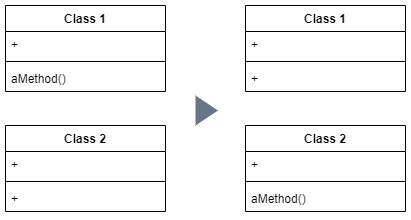

# Chapter 7. 객체 간의 기능 이동

기능을 어디에 넣을지 판단하는 것

##### Overview

필드이동 > 메서드 이동  
- 기능 위치 고민

클래스 추출 / 클래스 내용 직접 삽입 
- 클래스의 기능 정리

대리 객체 은폐 
- 모듈의 기능 정리

과잉중개 메서드 제거 
- 인터페이스 변경이 잦을 때

외래 클래스 메서드 추가 / 국소적 상속확장 클래스 사용 
- 원본 코드에 접근 할 수 없는 상황에서 수정 불가능한 클래스로 기능을 이동해야 할 경우 

### 메서드 이동



##### When
- 클래스 기능이 너무 많을 때
- 클래스 간 과하게 연동되어 의존성이 지나칠때
- 메서드를 많이 참조한다고 생각하는 객체 기준으로 진행 여부 결정

##### How
- 원본 메서드에 사용된 모든 기능 검사
- 원본 클래스의 하위클래스/상위클래스에서 그 메서드에 대한 다른 선언이 있는지 검사
- 그 메서드를 대상 클래스 안에 선언
- 원본 메서드의 코드를 대상 메서드에 복사 후 대상 클래스 안에서 잘 돌아가게끔 대상 메서드를 수정
- 대상 클래스 컴파일
- 원본 객체에서 대상 객채를 참조할 방법 확인
- 원본 메서드를 위임 메서드로 전환
- 컴파일과 테스트 실시
- 원본 메서드를 삭제하든 위임 메서드로 사용하든 선택
- 원본 메서드를 삭제할 때는 기존의 참조를 전부 대상 메서드 참조로 수정
- 컴파일과 테스트 실시

##### Example

```java
class Account {
    double overdraftCharge() {
        if (_type.isPremium()) {
            double result = 10;
            if (_daysOverdrawn > 7) result += (_daysOverdrawn - 7) * 0.85;
            return result;
        } else { return _daysOverdrawn * 1.75; }
    }
    
    double bankCharge() {
        double result = 4.5;
        if (_daysOverdrawn > 0) result += overdraftCharge();
        return result;
    }
    
    private AccountType _type;
    private int _daysOverdrawn;
}
```

목표 overdraftCharge()를 AccountType 클래스로 이동

Step 1. AccoutType 클래스로 메서드 복사
```java
class AccountType {
    double overdraftCharge(int daysOverdrawn) {
            if (isPremium()) {
                double result = 10;
                if (daysOverdrawn > 7) result += (daysOverdrawn - 7) * 0.85;
                return result;
            } else { return daysOverdrawn * 1.75; }
        }
}
```

Step 2. 적절한 작업 수행
- 기능 전체를 대상 클래스로 이동
- 대상 클래스에서 원본 클래스를 참조 생성 또는 사용
- 원본 객체를 대상 객체에 매개변수로 전달
- 기능이 변수라면 변수를 매개변수로 전달

Step 3. 원본 메서드의 코드를 위임코드로 변경
```java
class Account {
    double overdraftCharge() {
        return _type.overdraftCharge(_daysOverdrawn);
    }
    ...
}
```

Step 4. 컴파일 / 테스트

Step 5. 원본 클래스의 메서드 삭제를 위한 수정
```java
class Account {
    
    ...
    
    double bankCharge() {
        double result = 4.5;
        if (_daysOverdrawn > 0) result += _type.overdraftCharge(_daysOverdrawn);
        return result;
    }
    
    private AccountType _type;
    private int _daysOverdrawn;
}
```

Step 6. 원본 클래스에 메서드 정의 삭제

추가. 변수 한개 이상 전달 할 경우, 객체 전체를 전달해야 한다

### 필드 이동
### 클래스 추출
### 클래스 내용 직접 삽입
### 대리 객체 은폐
### 과잉 중개 메서드 제거
### 외래 클래스 메서드 추가
### 국소적 상속확장 클래스 사용

